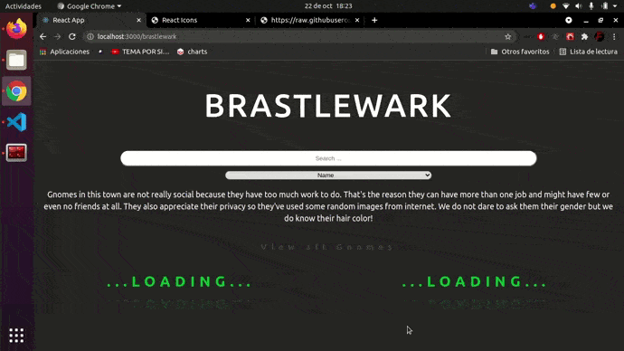
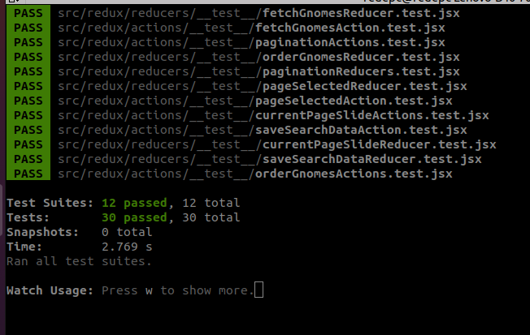

<h1 align="center">
  Welcome to Brastlewark
</h1>

<p align="center"></p>
<p align="center"></p>

<p align="center"><p> Orcs are not welcome </p></p>

## 🛠️ Installation Steps

1. Clone the repository

```bash
git clone https://github.com/FedericoGabrielCastro/Brastlewark.git
```

2. Change the working directory

```bash
cd Brastlewark
```

3. Install dependencies

```bash
npm install
```

4. Run the app

```bash
npm start
```

🌟 You are all set!

## 💻 Find the gnomes 

<p align="center"></p>

## 🙇 Without Internet ?

<p align="center"><p> We can wait... </p></p>

<p align="center"></p>

## 💻 Need Test ? 

<p align="center"></p>

<hr>
<p align="center">Don't ask the gender of the gnomes </p>

